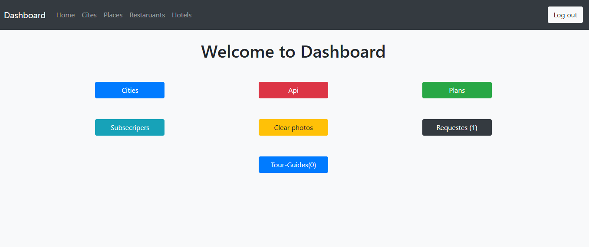
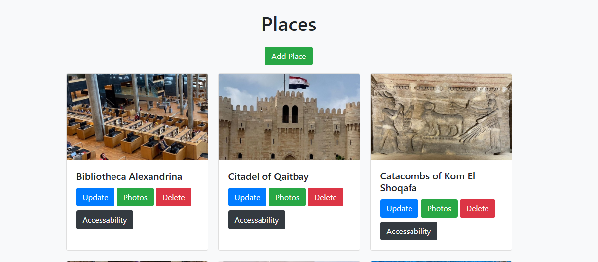
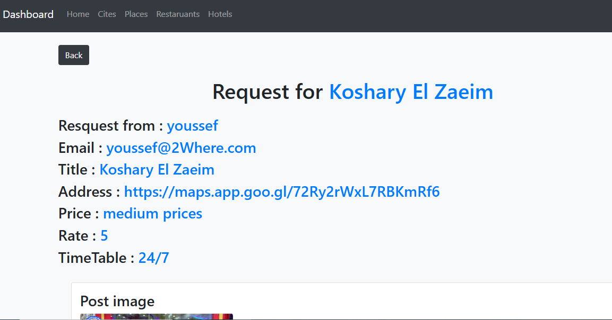
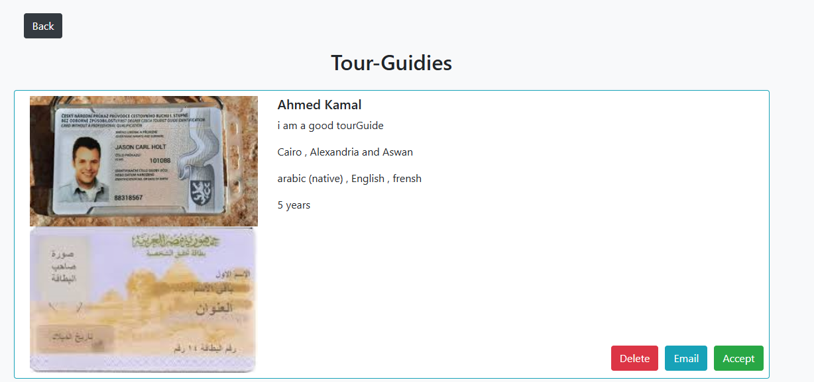
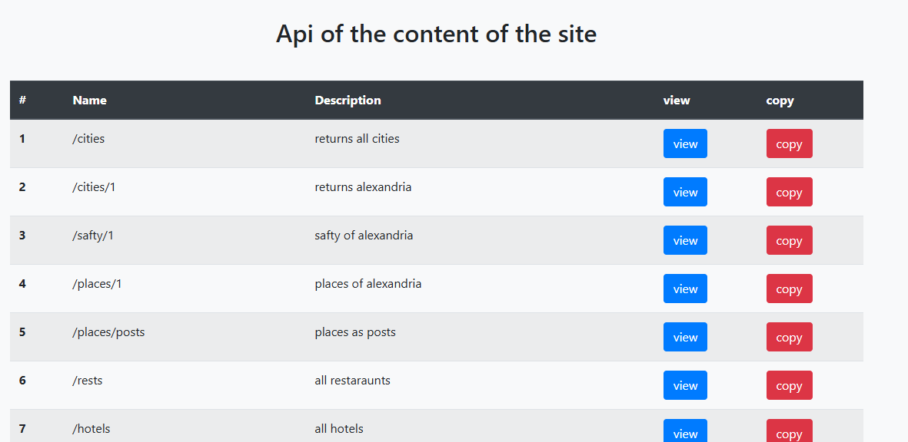

# 2Where Tourism Platform 

- A Backend system for 2where grudation project platform , made by laravel and my sql database , it contain an Admin Dashboard and RestFul Api.
_______________________

### Features
* Admin dashboard to manage Resources
* Handle owners requests
* Email verification for tourguides
* Resources CRUD operations
* Users subscriptions
* Plans Management

_______________________

### Built With
* <b>Backent :</b> Laravel 10
* <b>Frontend :</b> HTML, CSS, Bootstrap 5, JavaScript , JQuery
* <b>Database :</b> MySQL

_______________________

### ScreenShots

- Admin dashboard

________________

- Places resource

________________

- Restaruant request

________________

- Tour Guide request

________________
________________

- Api

________________

